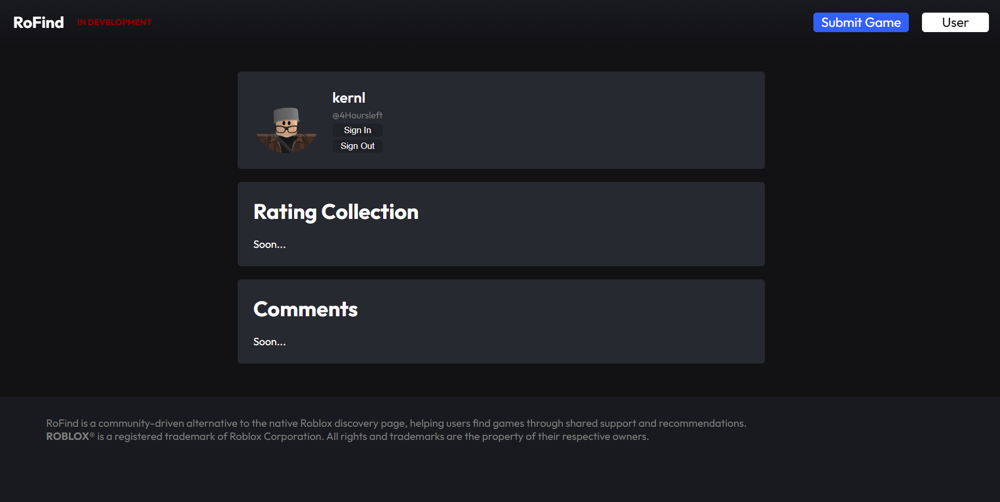
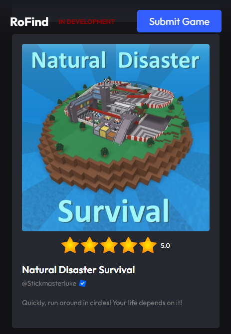

# RoFind
> Discover games worth playing, shared by the people who actually play them.

> man idk what im doing anymore i've spent days on this project.


[](#license)
[](https://ro-find.vercel.app)

---

<p align="center">
  
  
</p>
<p align="center">
  
</p>
<p align="center"><sub>These are early screenshots.</sub></p>

## What is RoFind?
RoFind is an open-source platform where players recommend, rate, and discover games together. Inspired by [better discovery](https://www.roblox.com/games/15317947079/better-discovery) - Mariage Sorcière on Roblox.

## (_Planned_) Features
- Browse games submitted by the community
- Rate and leave reviews
- Filter by genre, author, or popularity
- Submit your own game for others to find
- Login to save your reviews and ratings

## Getting Started

You'll need Node.js `v18+` and npm installed.

```bash
git clone https://github.com/RoFind/RoFind-Site.git
cd rofind
npm install
npm start
```

## Contributing

Got an idea or found a bug? Contributions are welcome! (I'm still new with JS and stuff so a contribution will be really appreciated :D)

1. Fork the repo
2. Create your branch — `git checkout -b feature/FeatureName`
3. Commit — `git commit -m 'Description'`
4. Push — `git push origin feature/FeatureName`
5. Open a Pull Request

## Roadmap
- [ ] Game submission system
  - Im having trouble here pls chill
- [ ] User profiles
- [ ] Rating & review system
- [ ] Search & filtering
- [ ] Moderation tools

## License
Free to use and modify. Just give me a heads up before redistributing.

---

<p align="center">Built by the community, for the community.</p>